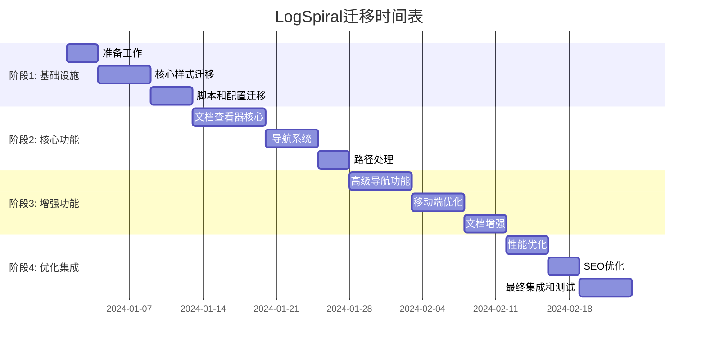

# LogSpiral到主项目的迁移计划

## 1. 项目差异分析

### 1.1 主要差异

| 方面 | 主项目 | LogSpiral |
|------|--------|-----------|
| **主题风格** | 浅色主题 (#fff 背景) | 深色主题 (#121212 背景) |
| **主色调** | 绿色 (#28a745) | 蓝色 (#007bff) |
| **分类系统** | 英文分类 (getting-started, basic-concepts等) | 中文分类 (0-开始, 1-基础等) |
| **文档结构** | 简单分类结构 | 详细的多级分类-主题-文件结构 |
| **配置文件** | 简单的config.json (236行) | 详细的config.json (2676行) |
| **生成脚本** | 618行的generate-index.js | 498行的generate-index.js |
| **特殊功能** | 基础文档查看 | 高级文档查看器、移动端导航、展开/收起功能等 |

### 1.2 LogSpiral的新功能列表

1. **高级文档查看器** (viewer.html)
   - 完整的Markdown渲染系统
   - 代码高亮支持 (Prism.js)
   - 自动生成目录
   - 文档元数据管理
   - SEO优化标签

2. **增强的侧边栏导航**
   - 多级分类-主题-文件结构
   - 展开/收起功能
   - 状态持久化 (localStorage)
   - 滚动优化和指示器

3. **移动端优化**
   - 专用移动端导航覆盖层
   - 响应式设计优化
   - 触摸友好的交互

4. **深色主题**
   - 完整的深色主题实现
   - 优化的对比度和可读性
   - 一致的视觉体验

5. **高级搜索和导航**
   - 智能路径处理
   - 旧路径重定向
   - 面包屑导航
   - 上一篇/下一篇导航

6. **性能优化**
   - 懒加载
   - 滚动性能优化
   - 资源加载优化

## 2. 迁移优先级排序

### 2.1 高优先级 (P0) - 核心功能

1. **文档查看器核心功能**
   - 理由: 这是LogSpiral最核心的功能，提供了完整的文档阅读体验
   - 影响: 直接影响用户体验和文档可用性
   - 依赖: 需要先迁移基础样式和脚本

2. **深色主题**
   - 理由: 提供更好的视觉体验，减少眼部疲劳
   - 影响: 影响所有用户的视觉体验
   - 依赖: 需要迁移基础CSS

3. **配置文件结构**
   - 理由: 支持更复杂的文档组织结构
   - 影响: 影响文档管理和导航
   - 依赖: 需要更新生成脚本

### 2.2 中优先级 (P1) - 增强功能

1. **增强的侧边栏导航**
   - 理由: 提供更好的导航体验
   - 影响: 改善用户查找文档的效率
   - 依赖: 需要先迁移配置文件结构

2. **移动端优化**
   - 理由: 提高移动设备用户体验
   - 影响: 影响移动端用户
   - 依赖: 需要先迁移基础布局和样式

3. **代码高亮和Markdown渲染**
   - 理由: 提高代码文档的可读性
   - 影响: 影响技术文档的质量
   - 依赖: 需要先迁移文档查看器

### 2.3 低优先级 (P2) - 优化功能

1. **高级搜索功能**
   - 理由: 增强文档查找能力
   - 影响: 提高用户查找特定信息的效率
   - 依赖: 需要先迁移基础导航

2. **性能优化**
   - 理由: 提高整体性能
   - 影响: 改善所有用户体验
   - 依赖: 需要在迁移过程中逐步实施

3. **SEO优化**
   - 理由: 提高搜索引擎可见性
   - 影响: 影响新用户发现
   - 依赖: 需要在最后阶段实施

## 3. 分阶段迁移计划

### 阶段1: 基础设施迁移 (1-2周)

#### 3.1.1 准备工作
- [ ] 创建迁移分支
- [ ] 设置开发环境
- [ ] 备份当前主项目
- [ ] 准备测试环境

#### 3.1.2 核心样式迁移
- [ ] 迁移深色主题CSS变量和基础样式
- [ ] 更新颜色系统 (从绿色到蓝色主题)
- [ ] 迁移响应式设计基础
- [ ] 测试基础样式兼容性

#### 3.1.3 脚本和配置迁移
- [ ] 迁移并适配generate-index.js
- [ ] 更新config.json结构
- [ ] 测试配置生成功能
- [ ] 验证文档索引正确性

**交付物**: 
- 支持深色/浅色主题的基础样式
- 更新的配置文件和生成脚本
- 基础测试报告

### 阶段2: 核心功能迁移 (2-3周) ✅ 已完成

#### 3.2.1 文档查看器核心 ✅
- [x] 创建viewer.html页面
- [x] 迁移Markdown渲染系统
- [x] 集成代码高亮 (Prism.js)
- [x] 实现基础文档加载功能

#### 3.2.2 导航系统 ✅
- [x] 迁移分类-主题-文件结构
- [x] 实现基础侧边栏导航
- [x] 添加面包屑导航
- [x] 实现文档元数据显示

#### 3.2.3 路径处理 ✅
- [x] 实现智能路径解析
- [x] 添加旧路径重定向
- [x] 测试各种路径格式
- [x] 优化错误处理

#### 3.2.4 模块化架构 ✅ (新增)
- [x] 创建AppController主控制器
- [x] 实现ConfigManager配置管理
- [x] 实现SearchManager搜索管理
- [x] 实现NavigationManager导航管理
- [x] 实现FolderManager文件夹管理
- [x] 实现SearchHistoryManager搜索历史管理
- [x] 实现PerformanceManager性能管理
- [x] 实现ResourceManager资源管理
- [x] 实现EventBus事件总线

#### 3.2.5 增强功能 ✅ (新增)
- [x] 增强文档查看器功能 (分类和主题导航、自动目录生成、面包屑导航、移动端导航支持)
- [x] 增强文件夹浏览功能 (搜索功能、面包屑导航、文档卡片式展示)
- [x] 增强搜索结果页面 (高级搜索语法支持、搜索历史和建议功能)
- [x] 代码结构优化 (模块化架构、降低代码耦合性、优化性能和加载速度)

**交付物**:
- [x] 功能完整的文档查看器
- [x] 更新的导航系统
- [x] 路径处理测试报告
- [x] 模块化架构实现
- [x] 增强功能页面
- [x] 性能优化报告
- [x] 兼容性测试报告

**完成时间**: 2025-11-28
**详细文档**: [MIGRATION-SUMMARY-PHASE2.md](MIGRATION-SUMMARY-PHASE2.md)

### 阶段3: 增强功能迁移 (2-3周)

#### 3.3.1 高级导航功能
- [ ] 实现展开/收起功能
- [ ] 添加状态持久化
- [ ] 优化滚动性能
- [ ] 添加滚动指示器

#### 3.3.2 移动端优化
- [ ] 实现移动端导航覆盖层
- [ ] 优化触摸交互
- [ ] 调整移动端布局
- [ ] 测试各种移动设备

#### 3.3.3 文档增强
- [ ] 实现自动目录生成
- [ ] 添加上一篇/下一篇导航
- [ ] 优化文档元数据显示
- [ ] 实现搜索建议功能

**交付物**:
- 完整的导航系统
- 移动端优化版本
- 增强的文档查看体验

### 阶段4: 优化和集成 (1-2周)

#### 3.4.1 性能优化
- [ ] 实现懒加载
- [ ] 优化资源加载
- [ ] 减少不必要的重绘
- [ ] 优化JavaScript执行

#### 3.4.2 SEO优化
- [ ] 更新meta标签
- [ ] 优化Open Graph标签
- [ ] 实现结构化数据
- [ ] 测试搜索引擎可见性

#### 3.4.3 最终集成和测试
- [ ] 全面功能测试
- [ ] 跨浏览器兼容性测试
- [ ] 性能基准测试
- [ ] 用户体验测试

**交付物**:
- 性能优化的完整系统
- SEO优化的页面
- 全面的测试报告

## 4. 风险评估和缓解措施

### 4.1 技术风险

| 风险 | 概率 | 影响 | 缓解措施 |
|------|------|------|----------|
| **样式冲突** | 高 | 高 | 使用CSS变量隔离主题，逐步迁移样式 |
| **JavaScript兼容性** | 中 | 高 | 使用模块化方法，保持向后兼容 |
| **路径解析错误** | 中 | 高 | 全面测试各种路径格式，实现回退机制 |
| **性能下降** | 中 | 中 | 实施性能监控，逐步优化 |
| **移动端兼容性** | 低 | 中 | 在多种设备上测试，使用渐进增强 |

### 4.2 项目风险

| 风险 | 概率 | 影响 | 缓解措施 |
|------|------|------|----------|
| **迁移时间延长** | 中 | 中 | 设置缓冲时间，优先级管理 |
| **功能回归** | 中 | 高 | 全面自动化测试，分阶段发布 |
| **用户体验中断** | 低 | 高 | 使用功能开关，渐进式发布 |
| **团队协作问题** | 低 | 中 | 清晰文档，定期沟通 |

### 4.3 缓解策略

1. **分阶段迁移**: 降低单次变更的风险
2. **功能开关**: 允许快速回滚特定功能
3. **自动化测试**: 确保每次变更不破坏现有功能
4. **监控和日志**: 快速识别和解决问题
5. **用户反馈渠道**: 及时收集和处理用户反馈

## 5. 代码结构优化建议

### 5.1 降低耦合性

#### 5.1.1 模块化JavaScript
```javascript
// 建议的模块结构
src/
├── core/
│   ├── config.js          // 配置管理
│   ├── router.js          // 路由管理
│   └── utils.js           // 工具函数
├── components/
│   ├── navigation.js      // 导航组件
│   ├── viewer.js          // 文档查看器
│   └── sidebar.js         // 侧边栏组件
├── themes/
│   ├── theme-manager.js   // 主题管理
│   ├── light-theme.js     // 浅色主题
│   └── dark-theme.js      // 深色主题
└── services/
    ├── document-service.js // 文档服务
    └── storage-service.js  // 存储服务
```

#### 5.1.2 CSS架构优化
```css
/* 使用CSS变量实现主题系统 */
:root {
  /* 颜色系统 */
  --primary-color: #28a745;
  --secondary-color: #6c757d;
  --background-color: #fff;
  --text-color: #333;
  --border-color: #e9ecef;
}

/* 深色模式绿色颜色保持不变 */
:root[data-theme="dark"] { 
    --primary-color: #28a745;
    --secondary-color: #6c757d;
    --background-color: #212529;
    --text-color: #fff;
    --border-color: #343a40;
}

/* 组件化CSS */
.component-name {
  /* 基础样式 */
}

.component-name__element {
  /* 元素样式 */
}

.component-name--modifier {
  /* 修饰符样式 */
}
```

#### 5.1.3 配置驱动开发
```javascript
// 配置驱动的组件
class DocumentViewer {
  constructor(config) {
    this.config = {
      theme: 'light',
      language: 'zh-CN',
      ...config
    };
  }
  
  render() {
    // 使用配置驱动渲染
  }
}
```

### 5.2 提高可维护性

1. **统一命名约定**: 使用一致的命名约定
2. **文档化代码**: 添加详细的代码注释和文档
3. **类型检查**: 使用JSDoc或TypeScript提供类型信息
4. **代码审查**: 建立代码审查流程
5. **自动化测试**: 实现单元测试和集成测试

### 5.3 性能优化

1. **懒加载**: 实现组件和资源的懒加载
2. **代码分割**: 按功能分割JavaScript代码
3. **缓存策略**: 实现适当的缓存策略
4. **资源优化**: 压缩和优化CSS、JavaScript和图片

## 6. 测试策略

### 6.1 测试类型

#### 6.1.1 单元测试
- **测试范围**: 独立函数和组件
- **工具**: Jest或Mocha
- **覆盖率目标**: 80%以上

```javascript
// 示例测试
describe('DocumentViewer', () => {
  test('should render markdown correctly', () => {
    const viewer = new DocumentViewer();
    const result = viewer.renderMarkdown('# Test');
    expect(result).toContain('<h1>Test</h1>');
  });
});
```

#### 6.1.2 集成测试
- **测试范围**: 组件间交互
- **工具**: Cypress或Playwright
- **测试场景**: 用户常见操作流程

#### 6.1.3 端到端测试
- **测试范围**: 完整用户流程
- **工具**: Selenium或Cypress
- **测试场景**: 关键用户路径

#### 6.1.4 视觉回归测试
- **测试范围**: UI外观
- **工具**: Percy或Chromatic
- **测试场景**: 不同主题和设备

### 6.2 测试环境

1. **本地测试**: 开发过程中的快速反馈
2. **测试环境**: 自动化测试执行
3. **预生产环境**: 最终验证
4. **生产监控**: 持续监控生产环境

### 6.3 测试计划

| 阶段 | 测试类型 | 重点 | 通过标准 |
|------|----------|------|----------|
| 阶段1 | 单元测试 | 基础功能 | 80%覆盖率 |
| 阶段2 | 集成测试 | 组件交互 | 核心流程通过 |
| 阶段3 | 端到端测试 | 用户场景 | 关键路径通过 |
| 阶段4 | 性能测试 | 性能指标 | 满足基准 |

## 7. 回滚计划

### 7.1 回滚触发条件

1. **关键功能失效**: 文档无法加载或显示
2. **性能严重下降**: 页面加载时间增加50%以上
3. **严重兼容性问题**: 主流浏览器无法正常使用
4. **用户体验严重受损**: 用户反馈强烈负面

### 7.2 回滚策略

#### 7.2.1 功能级别回滚
```javascript
// 使用功能开关控制功能
const FEATURES = {
  darkTheme: false,        // 回滚深色主题
  enhancedNav: false,      // 回滚增强导航
  mobileOptimization: false // 回滚移动端优化
};
```

#### 7.2.2 页面级别回滚
- 保留原始viewer.html作为备份
- 使用CDN或服务器配置快速切换
- 数据库或配置文件回滚

#### 7.2.3 完整回滚
- Git分支回滚到上一个稳定版本
- 数据库回滚（如适用）
- CDN缓存刷新

### 7.3 回滚执行步骤

1. **评估影响**: 确定回滚范围和影响
2. **通知团队**: 告知所有相关人员
3. **执行回滚**: 按照预定回滚策略执行
4. **验证系统**: 确保系统恢复正常
5. **通知用户**: 如有必要，通知用户系统变更
6. **分析问题**: 分析导致回滚的根本原因
7. **制定修复计划**: 制定问题修复和重新发布计划

### 7.4 回滚后行动

1. **问题分析**: 详细分析导致回滚的问题
2. **修复计划**: 制定详细的修复计划
3. **测试加强**: 加强相关测试，防止问题重现
4. **渐进重新发布**: 分阶段重新发布功能
5. **监控加强**: 加强监控，及时发现问题

## 8. 迁移时间表



## 9. 成功指标

### 9.1 技术指标

1. **性能指标**:
   - 页面加载时间 < 3秒
   - 首次内容绘制 < 1.5秒
   - 交互就绪时间 < 2秒

2. **质量指标**:
   - 代码覆盖率 > 80%
   - 关键功能100%可用
   - 零严重bug

3. **兼容性指标**:
   - 支持主流浏览器最新2个版本
   - 移动设备兼容性 > 95%

### 9.2 用户体验指标

1. **可用性指标**:
   - 任务完成率 > 95%
   - 用户满意度 > 4.5/5
   - 错误率 < 1%

2. **采用率指标**:
   - 新功能使用率 > 60%
   - 移动端访问增长 > 20%

## 10. 结论

本迁移计划提供了从LogSpiral到主项目的详细迁移路径，包括优先级排序、分阶段实施、风险缓解和测试策略。通过遵循此计划，我们可以确保平滑迁移，同时保持系统稳定性和用户体验。

关键成功因素:
1. **分阶段实施**: 降低风险，确保每个阶段的质量
2. **全面测试**: 确保功能正确性和性能
3. **用户反馈**: 及时收集和响应用户反馈
4. **监控和回滚**: 快速识别和解决问题

通过此迁移，主项目将获得LogSpiral的先进功能，同时保持其原有优势和用户群体。